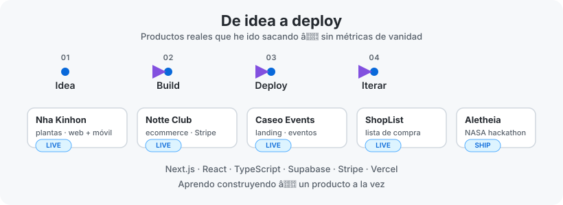

# Sergio Pérez Montalvo

**Aprendo construyendo**

Desarrollador Web FullStack

---

## Sobre mí

Desarrollador web autodidacta con foco en construir productos reales desde cero.

Me interesa especialmente el ecosistema SaaS: desde la idea hasta el despliegue, pasando por la integración de pagos, bases de datos y refinar el producto al máximo.

Cada proyecto es una forma de aprender algo nuevo y dejarlo documentado con el código.

---

## Stack

**Frontend**

**Backend**

**Infraestructura & Servicios**

**Vibe Coding**

+ zen

---

## Proyectos destacados

### 🌿 Nha Kinhon
Producto más reciente: app web para gestionar y explorar plantas medicinales y aromáticas.

`JavaScript` `Vercel`

🔗 [nha-kinhon.vercel.app](https://nha-kinhon.vercel.app) · [GitHub](https://github.com/stuffsergio/nha-kinhon)

---

### 👕 Notte Club
Ecommerce de moda con pasarela de pagos, inventario y panel de gestión.

`Next.js` `Stripe` `Supabase` `TailwindCSS`

🔗 [notteclub.es](https://notteclub.es)

---

### 🎪 Caseo Events
Landing para eventos y experiencias en vivo.

`Next.js` `Vercel`

🔗 [caseo-events.vercel.app](https://caseo-events.vercel.app)

---

### 🛒 ShopList
Tu lista de la compra a un solo click. Rápida, simple y siempre a mano.

`Next.js` `React` `TailwindCSS`

🔗 [GitHub](https://github.com/stuffsergio/ShopList)

---

### 🛰️ Aletheia
Sitio del NASA Space Apps Challenge: datos, visualización y narrativa en torno al proyecto.

`TypeScript` `Next.js`

🔗 [GitHub](https://github.com/stuffsergio/aletheia)

---

### 🧠 RemAInder *(en desarrollo)*
Gestor de tareas y notas con IA integrada para organizar, resumir y recuperar información.

`Next.js` `Supabase` `IA`

🔗 [gestor-tareas-amber.vercel.app](https://gestor-tareas-amber.vercel.app) · [GitHub](https://github.com/stuffsergio/gestor-tareas)

---

## Más en producción

Productos reales que sigo iterando, aunque el código vive en repos privados:

- **Nha Kinhon Mobile** — app móvil del ecosistema Nha Kinhon
- **Missy Baggie** — ecommerce de bolsos de crochet hechos a mano
- **Chiringuito Mauri** — web para negocio local
- **Missions** — generador de misiones diarias

También mantengo [docsy](https://github.com/stuffsergio/docsy) (docs y noticias) y mi [portfolio](https://github.com/stuffsergio/portfolio).

---

## De idea a deploy

<picture>
  <source media="(prefers-color-scheme: dark)" srcset="./assets/idea-a-deploy-dark.svg">
  <source media="(prefers-color-scheme: light)" srcset="./assets/idea-a-deploy-light.svg">
  
</picture>

---

